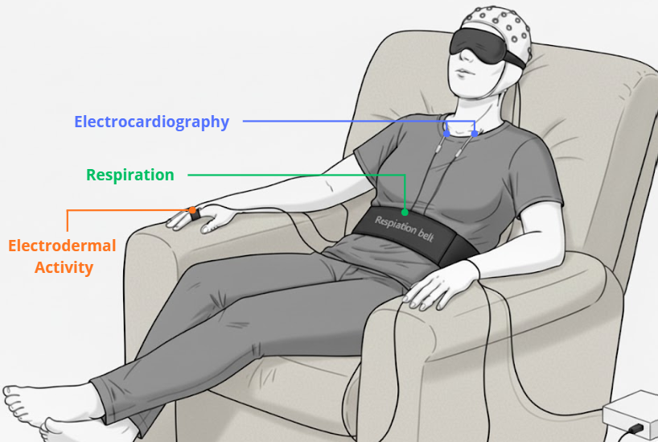

# DMT-Emotions Analysis

**Version**: 1.1.0 | **Last Updated**: 2026-01-11

Analysis pipeline for studying dose-dependent physiological and subjective responses to N,N-Dimethyltryptamine (DMT).



**Figure 1.** Experimental setup and multimodal physiological acquisition. Schematic illustration of the data recording environment. Participants were positioned on a sofa with eyes masked throughout the session. Labels indicate the placement of sensors for continuous peripheral monitoring: Electrocardiography (ECG), Respiration (thoracic effort belt), and Electrodermal Activity (EDA). These autonomic measures were acquired simultaneously with EEG during both Resting State and DMT administration blocks.

## Overview

This project analyzes the dose-dependent effects of DMT on physiological signals (ECG, EDA, Respiration) and retrospective subjective ratings (Temporal Experience Tracing), with a focus on multimodal integration and physiology-experience coupling.

### Study Design

- **Participants**: 19 enrolled (18 with valid TET data)
- **Design**: Within-subjects, dose-controlled (Low: 20mg, High: 40mg)
- **Conditions**: Resting State (RS) and DMT administration
- **Analysis window**: 0-9 min post-inhalation (30s bins)

### Validated Subjects per Modality

| Modality | N | Subjects |
|----------|---|----------|
| ECG (HR) | 11 | S04, S06, S07, S08, S10, S11, S15, S16, S18, S19, S20 |
| EDA (SMNA) | 11 | S04, S05, S06, S07, S09, S13, S16, S17, S18, S19, S20 |
| Respiration (RVT) | 12 | S04, S05, S06, S07, S09, S13, S15, S16, S17, S18, S19, S20 |
| TET | 18 | All except S12 |
| Multimodal (intersection) | 7 | For CCA analysis |

## Quick Start

### 1. Environment Setup

```bash
# Clone repository
git clone <repository-url>
cd dmt-emotions

# Create conda environment
micromamba create -n dmt-emotions -f environment.yml
micromamba activate dmt-emotions
```

### 2. Data Structure

The pipeline expects raw data in `../data/` (one level above the repository root). Paths are configured in `config.py`.

#### Required directory structure

```
../data/
├── original/
│   ├── physiology/                    # Raw BrainVision recordings
│   │   ├── DMT_1/                     # Session 1 DMT condition
│   │   │   ├── S01/
│   │   │   │   ├── S01_DMT_Session1_DMT.vhdr
│   │   │   │   ├── S01_DMT_Session1_DMT.eeg
│   │   │   │   └── S01_DMT_Session1_DMT.vmrk
│   │   │   ├── S02/
│   │   │   └── ...
│   │   ├── DMT_2/                     # Session 2 DMT condition
│   │   ├── Reposo_1/                  # Session 1 Resting State
│   │   │   └── S01/
│   │   │       ├── S01_RS_Session1_EC.vhdr
│   │   │       ├── S01_RS_Session1_EC.eeg
│   │   │       └── S01_RS_Session1_EC.vmrk
│   │   └── Reposo_2/                  # Session 2 Resting State
│   └── reports/
│       └── resampled/                 # TET retrospective ratings
│           ├── s01_RS_Session1_EC.mat
│           ├── s01_DMT_Session1_DMT.mat
│           ├── s01_RS_Session2_EC.mat
│           ├── s01_DMT_Session2_DMT.mat
│           └── ...
└── derivatives/                       # Created by preprocessing
    └── preprocessing/
        └── phys/
            ├── ecg/
            │   ├── dmt_high/
            │   └── dmt_low/
            ├── eda/
            └── resp/
```

#### File naming conventions

**Physiological data (BrainVision format):**
- DMT sessions: `{subject}_DMT_Session{1,2}_DMT.{vhdr,eeg,vmrk}`
- Resting State: `{subject}_RS_Session{1,2}_EC.{vhdr,eeg,vmrk}`
- Channels required: `ECG`, `GSR` (EDA), `RESP`

**TET data (.mat files):**
- Pattern: `s{XX}_{RS,DMT}_Session{1,2}_{EC,DMT}.mat`
- Contains: `dimensions` matrix (n_timepoints × 15 affective dimensions)
- Sampling: 0.25 Hz (1 point every 4 seconds)
- Duration: RS = 150 points (10 min), DMT = 300 points (20 min)

#### Preprocessing output

Running `src/preprocess_phys.py` creates the `derivatives/` structure with:
- Processed CSVs per subject/condition/signal
- CVX decomposition files for EDA (EDL, SMNA, EDR)
- EmotiPhai SCR event files

### 3. Run Complete Pipeline

#### One-liner to reproduce all results

**PowerShell:**
```powershell
python src/preprocess_phys.py; python src/run_ecg_hr_analysis.py; python src/run_eda_smna_analysis.py; python src/run_resp_rvt_analysis.py; python src/run_composite_arousal_index.py; python src/run_supplementary_analyses.py; python src/run_tet_analysis.py; python src/run_coupling_analysis.py; python src/run_figures.py
```

**Bash:**
```bash
python src/preprocess_phys.py && python src/run_ecg_hr_analysis.py && python src/run_eda_smna_analysis.py && python src/run_resp_rvt_analysis.py && python src/run_composite_arousal_index.py && python src/run_supplementary_analyses.py && python src/run_tet_analysis.py && python src/run_coupling_analysis.py && python src/run_figures.py
```

> Note: The coupling analysis (`run_coupling_analysis.py`) uses exact permutation testing with all 1,854 derangements for n=7 subjects, which completes in a few minutes.

#### Step-by-step execution

```bash
# 1. Preprocess physiological signals (if not already done)
python src/preprocess_phys.py

# 2. Individual physiological analyses
python src/run_ecg_hr_analysis.py      # Heart Rate (Figure 2a-b)
python src/run_eda_smna_analysis.py    # Sympathetic Activity (Figure 2c-d)
python src/run_resp_rvt_analysis.py    # Respiratory Volume (Figure 2e-f)

# 3. Composite Arousal Index (Figure 3)
python src/run_composite_arousal_index.py

# 4. Supplementary Analyses (Phase-based and Feature Extraction)
python src/run_supplementary_analyses.py

# 5. TET Analysis (Figure 4)
python src/run_tet_analysis.py

# 5. Physiology-Experience Coupling (Figure 5)
python src/run_coupling_analysis.py

# 6. Generate publication figures
python src/run_figures.py
```

## Pipeline Components

### Physiological Signal Processing

| Script | Signal | Output | Methods |
|--------|--------|--------|---------|
| `run_ecg_hr_analysis.py` | ECG | Heart Rate (z-scored) | NeuroKit2, LME with FDR, one-tailed tests |
| `run_eda_smna_analysis.py` | EDA | SMNA (sympathetic) | CVX decomposition, LME, one-tailed tests |
| `run_resp_rvt_analysis.py` | Respiration | RVT | NeuroKit2, LME, one-tailed tests |
| `run_supplementary_analyses.py` | All physio | Phase averages, features | Phase-based t-tests, feature extraction |

### Analysis Utility Modules

The following modules in `scripts/` provide enhanced statistical analyses and visualization capabilities:

| Module | Purpose | Key Functions |
|--------|---------|---------------|
| `alternative_statistics.py` | Less conservative statistical tests | `compute_one_tailed_tests()`, `compute_pointwise_uncorrected()` |
| `phase_analyzer.py` | Temporal phase-based analysis | `define_temporal_phases()`, `compute_phase_averages()`, `compare_doses_within_phases()` |
| `feature_extractor.py` | Extract temporal features | `extract_peak_amplitude()`, `extract_time_to_peak()`, `extract_threshold_crossings()` |
| `baseline_comparator.py` | DMT vs RS baseline comparisons | `compare_features_to_baseline()`, `visualize_baseline_comparisons()` |
| `enhanced_visualizer.py` | Publication-ready visualizations | `add_significance_markers()`, `apply_homogeneous_aesthetics()`, `save_figure_vector()` |
| `statistical_reporter.py` | APA-style statistical reporting | `format_ttest_result()`, `format_lme_result()`, `format_correlation_result()` |

**Scientific Rationale:**
- **Alternative Statistics**: One-tailed tests (High > Low) and uncorrected tests provide greater power for detecting dose-dependent effects when FDR correction is overly conservative
- **Phase Analysis**: Averaging within temporal phases (e.g., onset 0-3 min, recovery 3-9 min) detects dose differences obscured by temporal misalignment
- **Feature Extraction**: Peak amplitude, time-to-peak, and threshold crossings capture aspects of temporal dynamics not visible in time-aligned comparisons
- **Baseline Comparisons**: Quantify magnitude of DMT-induced changes relative to Resting State (independent of dose comparisons)
- **Enhanced Visualization**: Significance markers (*, **, ***) and homogeneous aesthetics ensure publication-ready figures
- **Statistical Reporting**: Complete APA-style reporting (test statistic, df, p-value, effect size) meets journal standards

### Composite Arousal Index

`run_composite_arousal_index.py` computes PC1 from joint physiological space (HR, SMNA, RVT):
- Explains ~59% of total variance
- Loadings: HR=0.63, SMNA=0.64, RVT=0.45
- Reveals dose-dependent autonomic activation during DMT

### Supplementary Analyses

`run_supplementary_analyses.py` performs additional analyses addressing temporal dynamics:

**1. Phase-Based Analysis:**
- Divides 9-minute window into temporal phases (onset: 0-3 min, recovery: 3-9 min)
- Compares High vs Low doses within each phase using paired t-tests
- Addresses potential temporal misalignment in pointwise comparisons
- **Key findings:**
  - ECG & EDA: Significant differences in recovery phase (p < 0.05)
  - RESP: Significant differences in onset phase (p = 0.030)
  - Reveals distinct temporal dynamics across autonomic systems

**2. Feature Extraction:**
- Extracts temporal features from each subject's time series:
  - **Peak amplitude**: Maximum physiological response magnitude
  - **Time-to-peak**: Speed of response onset (minutes)
  - **Threshold crossings**: Times when signal reaches 33% and 50% of maximum
- Compares features between doses using paired t-tests
- **Key findings (DMT dose comparison):**
  - ECG peak amplitude: High > Low (p = 0.042, d = 0.703)
  - RESP peak amplitude: Trend toward High > Low (p = 0.085, d = 0.546)
  - Characterizes magnitude and timing of dose-dependent responses

**3. Baseline Comparisons:**
- Compares DMT (doses collapsed) vs Resting State baseline
- Uses same extracted features (peak amplitude, time-to-peak, threshold crossings)
- Quantifies overall magnitude of DMT-induced changes independent of dose effects
- **Key findings (DMT vs RS):**
  - **All modalities show robust increases in peak amplitude** (p < 0.001-0.001, d = 1.2-4.3)
  - ECG shows dramatically faster time-to-peak in DMT (1.9 vs 5.0 min, p < 0.001, d = -2.051)
  - Provides reference for interpreting dose-dependent effects


### TET Analysis

`run_tet_analysis.py` processes 15 retrospective affective dimensions:

**Affective dimensions used in coupling analysis:**
- Pleasantness, Unpleasantness
- Emotional Intensity (arousal proxy)
- Interoception, Bliss, Anxiety

**Pipeline stages:**
1. Preprocessing → 2. Descriptive Stats → 3. LME Models → 4. PCA → 5. Figures

### Coupling Analysis

`run_coupling_analysis.py` performs physiology-experience integration:

1. **Linear correlations** (DMT state):
   - Emotional Intensity ~ HR: r = 0.44
   - Emotional Intensity ~ SMNA: r = 0.36
   - Emotional Intensity ~ RVT: r = 0.43

2. **Regression** (TET ~ Arousal Index):
   - DMT: R² = 30.5%, β = 0.32, p < .001
   - RS: R² = 0.4%, β = -0.04, p = .294

3. **Canonical Correlation Analysis (CCA)**:
   - DMT: Generalizable coupling (r_oos = 0.49, p = .008)
   - RS: Idiosyncratic coupling (r_oos = -0.28, fails CV)

## Output Structure

```
results/
├── ecg/hr/                    # HR analysis results
│   ├── plots/                 # Time courses, LME coefficients
│   ├── supplementary/         # Phase-based and feature extraction analyses
│   │   ├── phase_averages.csv
│   │   ├── phase_comparisons.csv
│   │   ├── phase_comparison.png
│   │   ├── extracted_features.csv
│   │   ├── feature_comparisons.csv
│   │   └── feature_comparison.png
│   └── *.csv                  # Long-format data, model results
├── eda/smna/                  # SMNA analysis results
│   ├── plots/
│   ├── supplementary/         # Phase-based and feature extraction analyses
│   └── *.csv
├── resp/rvt/                  # RVT analysis results
│   ├── plots/
│   ├── supplementary/         # Phase-based and feature extraction analyses
│   └── *.csv
├── composite/                 # Arousal Index results
│   ├── plots/                 # PCA scree, loadings, time courses
│   └── *.csv
├── tet/                       # TET analysis results
│   ├── figures/               # Time series, LME forest plots
│   └── *.csv                  # Preprocessed data, model results
├── coupling/                  # Coupling analysis results
│   ├── figures/               # CCA loadings, CV boxplots
│   └── *.csv                  # Correlations, CCA results
└── figures/                   # Final publication figures
    ├── figure_2.png           # Physiological signals (HR, SMNA, RVT)
    ├── figure_3.png           # Composite Arousal Index
    ├── figure_4.png           # TET affective dynamics
    ├── figure_5.png           # CCA coupling analysis
    └── figure_S*.png          # Supplementary figures
```

## Publication Figures

| Figure | Content | Source |
|--------|---------|--------|
| Figure 1 | Experimental setup (methods figure) | Manual creation |
| Figure 2 | HR, SMNA, RVT time courses + LME coefficients | Individual physio pipelines |
| Figure 3 | PCA scree, PC1 loadings, Arousal Index time course | `run_composite_arousal_index.py` |
| Figure 4 | TET time series, LME coefficients, PCA | `run_tet_analysis.py` |
| Figure 5 | CCA loadings, cross-validation, in-sample scatter | `run_coupling_analysis.py` |
| Figure S1 | Stacked subject trajectories (all modalities) | Individual physio pipelines |
| Figure S2 | Extended DMT HR time course (0-19 min) | `run_ecg_hr_analysis.py` |
| Figure S3 | Stacked subjects composite arousal | `run_composite_arousal_index.py` |
| Figure S4 | Extended DMT composite time course | `run_composite_arousal_index.py` |
| Figure S5 | PC1 regression 4-panel | `run_coupling_analysis.py` |

## Statistical Methods

### Linear Mixed Effects (LME)
- **Formula**: `Outcome ~ State * Dose + Time + State:Time + Dose:Time`
- **Random effects**: `~ 1 | Subject`
- **Correction**: Benjamini-Hochberg FDR by hypothesis family

### Time-to-Time Comparisons
- **Main analysis**: One-tailed paired t-tests (High > Low) with FDR correction for DMT condition
- **Rationale**: Directional hypothesis (High dose > Low dose) justified by pharmacological expectations
- **Control**: Two-tailed tests for Resting State (no directional hypothesis)
- **Results**: Robust dose-dependent effects detected in all modalities (ECG, EDA, RESP, Composite)

### Supplementary Analyses
- **Phase-based**: Paired t-tests comparing doses within temporal phases (onset: 0-3 min, recovery: 3-9 min)
- **Feature extraction**: Paired t-tests on extracted features (peak amplitude, time-to-peak, threshold crossings)
- **Purpose**: Address potential temporal misalignment and characterize response magnitude/timing
- **Consistency**: Results converge with main FDR time-to-time analyses

### Canonical Correlation Analysis (CCA)
- **Permutation testing**: Exact derangement enumeration (D(7) = 1,854 permutations where no subject is paired with itself)
- **Cross-validation**: Leave-One-Subject-Out (LOSO)
- **Significance**: t-test on out-of-sample correlations vs. 0

### PCA
- **Standardization**: Z-score normalization
- **Retention**: Kaiser criterion (eigenvalue > 1) + scree plot

## Data Quality Validation

### validation_log.json

This file documents the manual quality assessment of preprocessed physiological signals. It was created through visual inspection of each signal and determines which subjects are included in analyses.

**Structure:**
```json
{
  "metadata": {
    "categories": {
      "good": "Signal ready for analysis",
      "acceptable": "Usable with some limitations",
      "bad": "Not usable for analysis"
    }
  },
  "subjects": {
    "S04": {
      "dmt_session1_high": {
        "eda": {"category": "good", "notes": "..."},
        "ecg": {"category": "good", "notes": "..."},
        "resp": {"category": "acceptable", "notes": "..."}
      }
    }
  }
}
```

**Inclusion criteria:** A subject is included in a modality's analysis only if ALL 4 recordings (DMT_1, DMT_2, RS_1, RS_2) are rated `good` or `acceptable` for that signal type.

**Common issues documented:**
- Zero-padding at recording boundaries
- High-frequency noise artifacts
- Signal dropouts requiring interpolation
- Missing files from early sessions

The validated subject lists in `config.py` (`SUJETOS_VALIDADOS_ECG`, `SUJETOS_VALIDADOS_EDA`, `SUJETOS_VALIDADOS_RESP`) are derived from this validation log.

### Interactive Validation Script

> ⚠️ **WARNING**: Do NOT run this script unless you intend to modify `validation_log.json`. The validation has already been completed for all subjects.

`test/test_phys_preprocessing.py` is an interactive script for manual signal quality assessment:

1. Loads preprocessed CSVs from `src/preprocess_phys.py`
2. Generates NeuroKit plots for each signal (EDA, ECG, RESP)
3. For EDA: shows CVX decomposition (EDL, SMNA, EDR) with EmotiPhai events
4. Prompts user to rate quality (good/acceptable/bad) and add notes
5. Updates `validation_log.json` with evaluations

**Usage** (only if re-validation is needed):
```bash
python test/test_phys_preprocessing.py
```

This process evaluates ~240 files (20 subjects × 3 signals × 4 conditions) and takes several hours to complete manually.

## Configuration

Edit `config.py` to modify:
- Data paths (`PHYSIOLOGY_DATA`, `DERIVATIVES_DATA`, `REPORTS_DATA`)
- Validated subject lists per modality
- Dose assignments per subject/session
- Processing parameters

## Dependencies

Key packages (see `environment.yml` for full list):
- **Signal processing**: `neurokit2`, `mne`, `biosppy`
- **Statistics**: `statsmodels`, `scipy`, `scikit-learn`
- **Visualization**: `matplotlib`, `seaborn`
- **Data**: `pandas`, `numpy`

## Project Structure

```
dmt-emotions/
├── src/                       # Main analysis pipelines
│   ├── preprocess_phys.py     # Physiological preprocessing
│   ├── run_ecg_hr_analysis.py
│   ├── run_eda_smna_analysis.py
│   ├── run_resp_rvt_analysis.py
│   ├── run_composite_arousal_index.py
│   ├── run_tet_analysis.py    # TET pipeline orchestrator
│   ├── run_coupling_analysis.py
│   └── run_figures.py         # Publication figure assembly
├── tet/                       # TET analysis modules
│   ├── data_loader.py         # Load .mat files
│   ├── preprocessor.py        # Trimming, z-scoring
│   ├── lme_analyzer.py        # Linear mixed effects
│   ├── pca_analyzer.py        # Principal components
│   ├── physio_cca_analyzer.py # Canonical correlation
│   └── ...                    # Other TET modules
├── scripts/                   # Analysis utility modules
│   ├── alternative_statistics.py    # One-tailed and uncorrected tests
│   ├── phase_analyzer.py            # Temporal phase analysis
│   ├── feature_extractor.py         # Peak detection, time-to-peak
│   ├── baseline_comparator.py       # DMT vs RS comparisons
│   ├── enhanced_visualizer.py       # Significance markers, aesthetics
│   ├── statistical_reporter.py      # APA-style formatting
│   ├── preprocess_tet_data.py       # TET preprocessing script
│   ├── compute_descriptive_stats.py
│   ├── fit_lme_models.py
│   └── compute_pca_analysis.py
├── test/                      # Testing scripts
│   └── test_phys_preprocessing.py
├── results/                   # Analysis outputs
├── config.py                  # Central configuration
├── environment.yml            # Conda environment
└── README.md
```


## Citation

If you use this pipeline in your research, please cite:

```bibtex
@article{dmt-emotions,
  title={Dose-dependent physiological and subjective responses to DMT: A multimodal analysis pipeline},
  author={[Authors]},
  journal={[Journal]},
  year={2025},
  doi={[DOI]}
}
```
