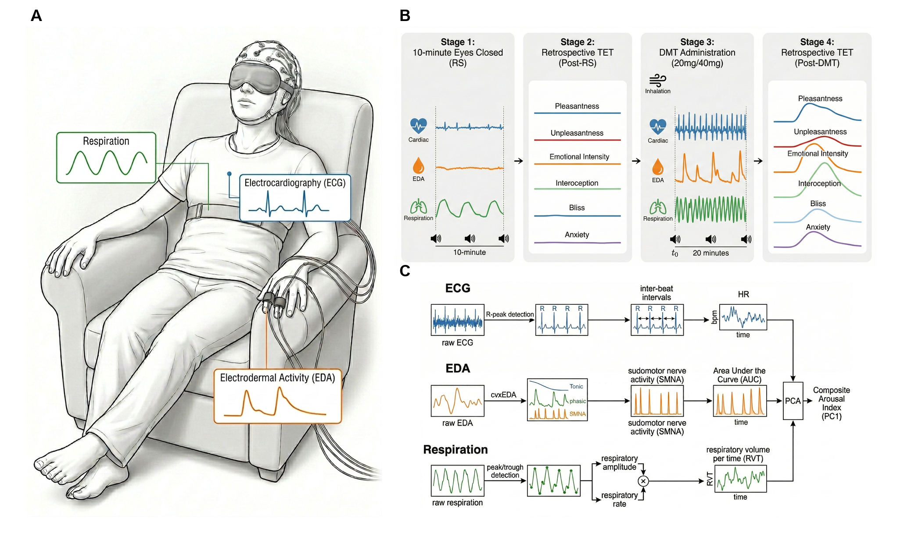

# Multimodal autonomic arousal during the acute effects of DMT

Analysis code accompanying the paper:

> D'Amelio, T. A., Gil Garbagnoli, T., Rodríguez Cuello, J., Lewis-Healey, E., Pallavicini, C., Cavanna, F., Bruno, N. M., De La Fuente, L. A., Müller, S., Copa, D., Bekinschtein, T., Vidaurre, D., Tagliazucchi, E. (2026). *Multimodal autonomic arousal tracks dose-dependent affective dynamics during the acute effects of DMT* (in preparation).

This repository reproduces all main and Extended Data figures and statistical results from the paper. The accompanying dataset is archived on Zenodo at [`10.5281/zenodo.19893951`](https://doi.org/10.5281/zenodo.19893951). A citable snapshot of this codebase is at [`10.5281/zenodo.YYYYYYY`](https://doi.org/10.5281/zenodo.YYYYYYY).

---

## Overview

The study used a within-subjects, randomised and counterbalanced 2 × 2 design (Dose × State) to characterise the temporal dynamics of autonomic arousal and affective experience during the acute effects of inhaled freebase N,N-dimethyltryptamine (DMT). Nineteen experienced volunteers attended two semi-naturalistic sessions, each comprising a 10-minute eyes-closed Resting State (RS) baseline followed by inhalation of 20 mg or 40 mg DMT and 20 minutes of post-inhalation recording. Cardiac (ECG), electrodermal (EDA), and respiratory activity were recorded continuously with a Brain Products amplifier. Time-resolved subjective experience was captured retrospectively after each block using the Temporal Experience Tracing (TET) method, in which participants traced the intensity of 15 experiential dimensions on a continuous canvas at 0.25 Hz. The pipeline implemented in this repository combines these modalities into a single Physiological Arousal Index (PCA on z-scored signals), characterises dose- and state-dependent dynamics with linear mixed-effects models, and quantifies the coupling between autonomic and affective dynamics with regression and Canonical Correlation Analysis.



**Figure 1 — Experimental design, multimodal data acquisition, and signal-processing pipeline.**
**a**, Recording setup. Participants rested on a sofa with eyes masked throughout the session. Peripheral physiological signals were recorded continuously using a Brain Products amplifier: Electrocardiography (ECG; modified lead II bipolar montage), Respiration (thoracic effort belt), and Electrodermal Activity (EDA; finger electrodes), simultaneously with EEG.
**b**, Experimental timeline. Each session comprised four stages: a 10-min eyes-closed Resting State (RS) baseline with continuous physiological recording, retrospective Temporal Experience Tracing (TET) of the RS baseline, DMT inhalation (20 or 40 mg freebase) followed by 20 minutes of recording, and retrospective TET of the DMT experience. Auditory chimes every two minutes served as temporal anchors for retrospective tracing.
**c**, Signal processing and feature extraction. ECG, EDA, and respiration signals were processed to extract heart rate (HR), sudomotor nerve activity (SMNA) via cvxEDA decomposition, and respiratory volume per time (RVT). These autonomic time series were then combined via principal component analysis (PCA) to yield a Physiological Arousal Index.

---

## Repository structure

```
.
├── config.py                       # Centralised paths, constants, channel mapping
├── environment.yml                 # Conda environment (sufficient to reproduce the paper)
├── src/
│   ├── figure_config.py            # Centralised figure styling (Nature)
│   ├── preprocess_phys.py          # ECG / EDA / RVT preprocessing pipeline
│   ├── run_ecg_hr_analysis.py      # Heart rate analyses (Fig 2a, b)
│   ├── run_eda_smna_analysis.py    # Sudomotor nerve activity (Fig 2c, d)
│   ├── run_resp_rvt_analysis.py    # Respiratory volume per time (Fig 2e, f)
│   ├── run_composite_arousal_index.py
│   │                               # Multimodal Physiological Arousal Index (Fig 3)
│   ├── run_tet_analysis.py         # Affective dynamics (Fig 4)
│   ├── run_coupling_analysis.py    # Physiology-experience coupling (Fig 5, partial)
│   ├── run_temporal_resolution_sensitivity.py
│   │                               # Sensitivity to TET temporal resolution
│   ├── run_supplementary_analyses.py
│   └── run_figures.py              # Composes Figures 2-5 from analysis outputs
├── scripts/
│   ├── compose_figure_1.py         # Composes Figure 1 from individual panels
│   ├── baseline_comparator.py      # Helper for run_supplementary_analyses
│   ├── feature_extractor.py        # Helper for run_supplementary_analyses
│   ├── phase_analyzer.py           # Helper for run_supplementary_analyses
│   ├── run_blinding_chisquare.py   # Post-hoc blinding-efficacy chi-square test
│   └── heteroscedastic_lme.R       # Heteroscedastic LME re-estimation in R/nlme
├── tet/                            # TET preprocessing utilities (Temporal Experience Tracing)
└── results/
    └── figures/                    # Publication figures (Fig 1-5, Extended Data Fig 1-5)
```

Only `results/figures/` is versioned in git. The rest of `results/` (per-modality statistical reports, intermediate outputs) is generated locally when the pipeline runs (see [Reproducing the analyses](#reproducing-the-analyses) below).

---

## Installation

The pipeline is developed and tested with Python 3.11 (matplotlib, numpy, pandas, scipy, scikit-learn, statsmodels, neurokit2, biosppy, mne) and R ≥ 4.2 (only for the supplementary heteroscedastic LME analysis).

We recommend [`micromamba`](https://mamba.readthedocs.io/en/latest/installation/micromamba-installation.html) for environment management.

```bash
git clone https://github.com/tomdamelio/dmt-emotions.git
cd dmt-emotions

micromamba create -n dmt-emotions -f environment.yml
micromamba activate dmt-emotions
```

`environment.yml` pins every dependency required to regenerate the figures and statistical results reported in the paper.

---

## Data

The raw recordings and preprocessed derivatives that this pipeline operates on are released on Zenodo:

> **Dataset DOI:** [`10.5281/zenodo.19893951`](https://doi.org/10.5281/zenodo.19893951) (CC-BY 4.0)

After cloning this repository, download `original.zip` and `derivatives.zip` from the Zenodo deposit and unzip them next to the repository so that the directory layout matches:

```
parent/
├── dmt-emotions/                   # this repository
└── data/
    ├── original/
    │   ├── physiology/             # raw BrainVision recordings (.eeg, .vhdr, .vmrk)
    │   └── reports/resampled/      # TET retrospective ratings (.mat)
    └── derivatives/
        └── preprocessing/phys/
            ├── ecg/{dmt_high, dmt_low, rs_high, rs_low}/
            ├── eda/{dmt_high, dmt_low, rs_high, rs_low}/
            └── resp/{dmt_high, dmt_low, rs_high, rs_low}/
```

Path resolution is centralised in `config.py`; if your data lives elsewhere, edit the `DATA_ROOT` constant there.

Per-subject metadata (dose order, modality-specific inclusion flags) is provided in the deposit's `participants.tsv`. Group-level demographics are reported in the paper (Methods → Participants).

---

## Reproducing the analyses

The full pipeline runs in two stages: (1) preprocessing of raw physiology, and (2) modality-specific and integrative analyses.

### Stage 1 — Preprocessing (only needed if starting from raw data)

If you already downloaded the `derivatives.zip` from Zenodo, you can skip this stage.

```bash
python src/preprocess_phys.py    # Generates data/derivatives/preprocessing/phys/{ecg,eda,resp}/
```

### Stage 2 — Analyses and figures

```bash
# Modality-specific physiological analyses (Figure 2)
python src/run_ecg_hr_analysis.py
python src/run_eda_smna_analysis.py
python src/run_resp_rvt_analysis.py

# Multimodal integration (Figure 3)
python src/run_composite_arousal_index.py

# Affective dynamics (Figure 4)
python src/run_tet_analysis.py

# Physiology-experience coupling (Figure 5)
python src/run_coupling_analysis.py

# Robustness analyses (Extended Data and Methods)
python src/run_temporal_resolution_sensitivity.py
python src/run_supplementary_analyses.py
python scripts/run_blinding_chisquare.py
Rscript scripts/heteroscedastic_lme.R   # requires R ≥ 4.2 with nlme

# Compose final publication figures (Figure 1 from panels, Figures 2-5 from analyses)
python scripts/compose_figure_1.py
python src/run_figures.py
```

After completion, all main figures and Extended Data figures are written to `results/figures/`, and statistical reports are in `results/{ecg,eda,resp,composite,coupling,tet,blinding}/`.

---

## Statistical methods

A short summary of the statistical strategy implemented in the pipeline; the full description is in the paper's Methods section.

- **Linear mixed-effects models (LME)**: every outcome (HR, SMNA, RVT, Physiological Arousal Index, TET dimensions) was modelled with State, Dose, mean-centred Time, and the State × Dose, State × Time, and Dose × Time interactions as fixed effects, plus a random intercept per participant. Models were fitted by REML in `statsmodels`. Standardised coefficients with 95% confidence intervals are reported.
- **Time-resolved comparisons**: paired t-tests at each 30-s window (physiology) or 4-s sample (TET), one-tailed for *a priori* directional hypotheses during DMT and two-tailed elsewhere. Multiple comparisons across time were controlled with Benjamini–Hochberg FDR.
- **PCA**: applied to the within-subject z-scored physiological time series (HR, SMNA, RVT) to derive the Physiological Arousal Index (PC1), and to the six pre-defined affective TET dimensions to derive arousal and valence components.
- **Canonical Correlation Analysis (CCA)**: between physiological and affective spaces; significance via exact subject-level permutation testing (1,854 derangements for n = 7), and generalisation via leave-one-subject-out cross-validation.
- **Robustness checks**: heteroscedastic-residual LME re-estimation (`scripts/heteroscedastic_lme.R`); sensitivity of TET-based effects to temporal binning (`src/run_temporal_resolution_sensitivity.py`); post-hoc blinding-efficacy chi-square (`scripts/run_blinding_chisquare.py`).

---

## Configuration

`config.py` centralises:

- File-system paths (raw data root, derivatives root, results root).
- Channel mapping (which BrainVision channel index corresponds to ECG / Resp / EDA).
- Subject inclusion lists per modality.
- Statistical thresholds and plotting parameters.

`src/figure_config.py` centralises figure styling (column widths in Nature units, font sizes, palettes, panel-label helpers).

---

## Citation

If you use this code or the associated dataset, please cite both:

```bibtex
@article{DAmelio2026,
  author  = {D'Amelio, Tom\'{a}s Ariel and Gil Garbagnoli, Tom\'{a}s and
             Rodr\'{i}guez Cuello, Jer\'{o}nimo and Lewis-Healey, Evan and
             Pallavicini, Carla and Cavanna, Federico and Bruno, Nicol\'{a}s Marcelo and
             De La Fuente, Laura Alethia and M\"{u}ller, Stephanie and Copa, D\'{e}bora and
             Bekinschtein, Tristan and Vidaurre, Diego and Tagliazucchi, Enzo},
  title   = {Multimodal autonomic arousal tracks dose-dependent affective dynamics
             during the acute effects of DMT},
  year    = {2026},
  note    = {in preparation}
}

@dataset{DAmelio2026Data,
  author    = {D'Amelio, Tom\'{a}s Ariel and others},
  title     = {Multimodal autonomic and phenomenological data for the acute effects
               of N,N-dimethyltryptamine (DMT)},
  publisher = {Zenodo},
  year      = {2026},
  doi       = {10.5281/zenodo.19893951}
}
```

---

## License

This code is released under the [MIT License](LICENSE).

The dataset associated with this code is released separately on Zenodo under the [Creative Commons Attribution 4.0 International (CC-BY-4.0)](https://creativecommons.org/licenses/by/4.0/) license.

---

## Contact

For questions about the code, please open an issue on this repository.
For questions about the study or data, please contact the corresponding author:

> **Tomás Ariel D'Amelio** — `dameliotomas@gmail.com`
